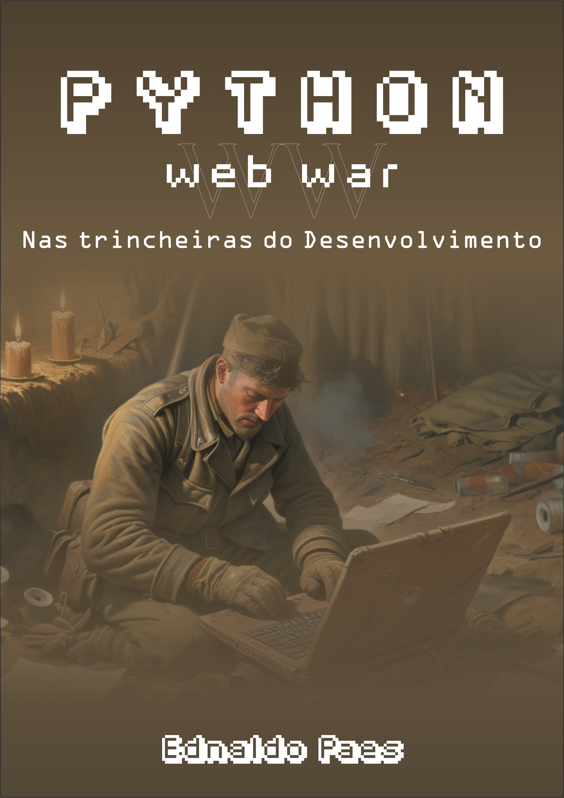

# Projeto EBOOK python

 > ℹ️ **NOTE:** Este é o repositório em desenvolvimento, semanalmente um novo capítulo será adicionado.

Projeto com o objetivo de gerar um ebook digital com as facilidades das ferramentas de IA. todos os prompts seguem abaixo.

<a href="https://github.com/kuruminpz/Projeto-EBOOK-python---Ednaldo-Paes/blob/main/output/ebook%20-%20Python%20Web%20War%20-%20Nas%20Trincheiras%20do%20Desenvolvimento%20%5BCap%201%5D.pdf" title="View PDF now"> 📕Clique aqui para ler</a>

## 💻 Tecnologias utilizadas no projeto

- [ChatGPT](https://chat.openai.com/) 
- [MidJourney](https://www.midjourney.com/app/)
- [PowerPoint](https://www.microsoft.com/en/microsoft-365/powerpoint)

## 🧠 Prompts

ChatGPT：

|   Ação   | prompt                                                                                                                                                                                                                                                                         |
| :------: | ------------------------------------------------------------------------------------------------------------------------------------------------------------------------------------------------------------------------------------------------------------------------------ |
|  título  | crie um título para um ebook com o tema sobre python, o nicho do ebook é programação e o subnicho é desenvolvimento web backend, crie um título épico e curto, e tenha uma temática gamer. me de 5 variações.                                                        |
| conteúdo Capítulo 1| faça um texto para ebook, com foco em Python Web, listando o ambiente da web e seus principais tipos de requests, códigos de retorno e para que eles servem. {REGRAS} > Explique sempre de maneiras simples, > Deixe o texto enxuto, > Sempre traga exemplos de codigos em contextos reais, > Sempre traga um paupite de titulo |

Midjourney：

|  Ação  | prompt                                                                                 |
| :----: | -------------------------------------------------------------------------------------- |
| título | A soldier developing Python inside a trench in WW1 |

## ✨ Features

- Conteúdo gerado via ChatGPT
- Imagens geradas via MidJourney

## 📚 Materiais

- Imagens utilizadas em `assets`
- ebook gerado durante as aulas em `output`

## 🛠️ Instruções de execução

Utilize os prompts acima nas ferramentas sugeridas para gerar o material base e utilize uma ferramenta de edição de documentos como power point, libreoffice , indesign para diagramação.
